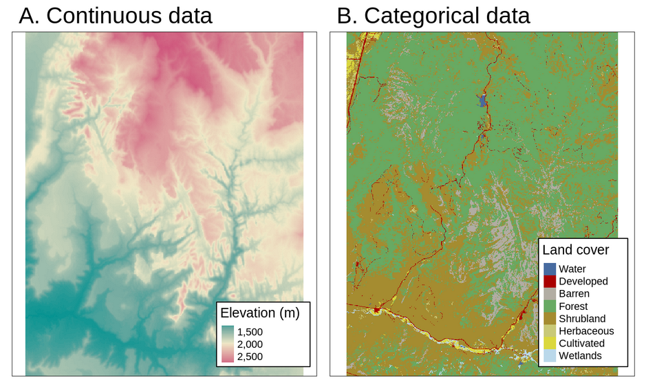

```{r setup, include=FALSE}
library(knitr)

knitr::opts_chunk$set(echo = TRUE)
```

## Recursos de interés
* [Geocomputation with R - Chapter 2 Geographic data in R - Raster data](https://geocompr.robinlovelace.net/spatial-class.html#raster-data)
* [Geocomputation with R - Chapter 3 Attribute data operations - Manipulating raster objects](https://geocompr.robinlovelace.net/attr.html#manipulating-raster-objects)
* [Geocomputation with R - Chapter 4 Spatial data operations - Spatial operations on raster data](https://geocompr.robinlovelace.net/spatial-operations.html#spatial-ras)

* [The raster package -- R Spatial](https://rspatial.org/raster/pkg/)  
* [raster: Geographic Data Analysis and Modeling](https://rdrr.io/cran/raster/)

* Sitio web del curso: [GF-0604: Procesamiento de datos geográficos](https://geoprocesamiento-2020i.github.io/).
* Datos utilizados durante el curso: [Datos del curso GF-0604: Procesamiento de datos geográficos](https://github.com/geoprocesamiento-2020i/datos).

## Preparativos
Paquetes
```{r results='hide', warning = FALSE, message=FALSE}
# Paquete para manejo de datos vectoriales
library(sf)

# Paquete de Tidyverse para manipulación de datos
library(dplyr)

# Paquete para mapas en la Web
library(leaflet)
```

Datos para ejemplos
```{r results='hide', warning = FALSE, message=FALSE}
# Registros de presencia de Ara ambiguus (lapa verde) en Costa Rica
cr_ara_ambiguus <-
  st_read(
    "https://raw.githubusercontent.com/geoprocesamiento-2020i/datos/master/biodiversidad/registros-presencia/cr/cr-ara-ambiguus.geojson"
  )
```

## El modelo de datos raster
El modelo de datos raster usualmente consiste de un encabezado y de una matriz con celdas (también llamadas pixeles) de un mismo tamaño. El encabezado define el [sistema de referencia de coordenadas (CRS)](https://en.wikipedia.org/wiki/Spatial_reference_system), la extensión y el punto de origen de una capa raster. Por lo general, el origen se ubica en la esquina inferior izquierda o en la esquina superior izquierda de la matriz. La extensión se define mediante el número de filas, el número de columnas y el tamaño (resolución) de la celda.

Cada celda tiene una identificación (ID) y almacena un único valor, el cual puede ser numérico o categórico, como se muestra en la figura 1. 


A diferencia del modelo vectorial, el modelo raster no necesita almacenar todas las coordenadas de cada geometría (i.e. las esquinas de las celdas), debido a que la ubicación de cada celda puede calcularse a partir de la información contenida en el encabezado. Esta simplicidad, en conjunto con el [álgebra de mapas](https://en.wikipedia.org/wiki/Map_algebra), permiten que el procesamiento de datos raster sea mucho más eficiente que el procesamiento de datos vectoriales. Por otra parte, el modelo vectorial es mucho más flexible en cuanto a las posibilidades de representación de geometrías y almacenamiento de valores, por medio de múltiples elementos de datos.

Los mapas raster generalmente almacenan fenómenos continuos como elevación, precipitación, temperatura, densidad de población y datos espectrales. También es posible representar mediante raster datos discretos, tales como tipos de suelo o clases de cobertura de la tierra, como se muestra en la figura 2.



## El paquete raster
El paquete [raster](https://cran.r-project.org/web/packages/raster/) proporciona funciones para la lectura, escritura, manipulación, análisis y modelado de datos raster.

El paquete [rgdal](https://cran.r-project.org/web/packages/rgdal/) provee enlaces a las bibliotecas [GDAL](https://gdal.org/) y [PROJ](https://proj.org/).

### Instalación, carga y documentación
Instalación
```{r eval = F}
# Instalación del paquete raster
install.packages("raster")

# Instalación del paquete raster
install.packages("rgdal")
```

Carga
```{r results='hide', warning = FALSE, message=FALSE}
# Carga del paquete raster
library(raster)

# Carga del paquete rgdal
library(rgdal)
```

Ayuda
```{r eval = F}
# Ayuda sobre paquete raster
help("raster-package")
```

Documentación:  
- [The raster package -- R Spatial](https://rspatial.org/raster/pkg/)  
- [raster: Geographic Data Analysis and Modeling](https://rdrr.io/cran/raster/)

### Formatos raster
El paquete _raster_ puede leer y escribir en una gran cantidad de [formatos raster](https://gdal.org/drivers/raster/) a través de la biblioteca GDAL.

### Uso básico
Para ejemplificar el uso del paquete ```raster```, se accederá a la base de datos climáticos [WorldClim](https://www.worldclim.org/), mediante la función [getData()](https://rdrr.io/cran/raster/man/getData.html).

```{r}
# Directorio de trabajo (DEBE USARSE UN DIRECTORIO EXISTENTE EN EL DISCO)
setwd("c:/users/mfvargas/")

# Consulta del directorio de trabajo
getwd()

# Datos de altitud
altitude <- getData("worldclim", var="alt", res=.5, lon=-84, lat=10)

# Datos de altitud recortados para los límites aproximados de Costa Rica
cr_altitude <- crop(altitude, extent(-86, -82.3, 8, 11.3))	

# Resumen de información básica de la capa raster
cr_altitude
```

#### Tipos de datos
El paquete ```raster``` define dos tipos de datos principales:

**RasterLayer**: almacena una sola capa.
```{r}
# Clase de cr_altitude
class(cr_altitude)

# Cantidad de capas
nlayers(cr_altitude)

# Mapeo
plot(cr_altitude)
```

**RasterBrick**: almacena varias capas, las cuales generalmente provienen de un mismo origen (ej. una imagen satelital).
```{r}
# Datos de precipitación
precipitation <- getData("worldclim", var="prec", res=.5, lon=-84, lat=10)

# Datos de precipitación recortados para los límites aproximados de Costa Rica
cr_precipitation <- crop(precipitation, extent(-86, -82.3, 8, 11.3))

# Clase de cr_precipitacion
class(cr_precipitation)

# Cantidad de capas
nlayers(cr_precipitation)

# Lista e información sobre las capas
unlist(cr_precipitation)

# Mapeo
plot(cr_precipitation)
```

**RasterStack**: también almacena varias capas, pero a diferencia de ```RasterBrick```, estas provienen de diferentes fuentes. 

#### Confección de mapas

Ejemplo de mapa en Leaflet
```{r results='hide', warning = FALSE}
# Paleta de colores
pal <- colorNumeric(
  c("#0C2C84", "#41B6C4", "#FFFFCC"), 
  values(cr_altitude), 
  na.color = "transparent"
)

# Mapa web
m <- leaflet() %>% 
  addProviderTiles(providers$Esri.WorldImagery, group = "Imágenes de ESRI") %>% 
  addProviderTiles(providers$Stamen.TonerLite, group = "Stamen Toner Lite") %>%
  addProviderTiles(providers$OpenStreetMap.Mapnik, group = "OpenStreetMap") %>%
  addCircleMarkers(data = cr_ara_ambiguus,
                   stroke = F,
                   radius = 4,
                   fillColor = 'green',
                   fillOpacity = 1,
                   group = "Ara ambiguus",
                   popup = paste(cr_ara_ambiguus$locality, 
                                 cr_ara_ambiguus$year, 
                                 sep = '<br/>'
                           )
  ) %>%
  addRasterImage(cr_altitude, 
                 colors = pal, 
                 opacity = 0.8, 
                 group = "Altitud"
  ) %>%
  addLayersControl(
    baseGroups = c("OpenStreetMap", "Stamen Toner Lite", "Imágenes de ESRI"),
    overlayGroups = c("Altitud", "Ara ambiguus"),
    options = layersControlOptions(collapsed = FALSE)    
  ) %>%
  addLegend(pal = pal, 
            values = values(cr_altitude), 
            title = "Altitud"
  ) %>%
  addMiniMap(
    toggleDisplay = TRUE,
    position = "bottomleft",
    tiles = providers$Stamen.TonerLite
  )
```

```{r}
# Despliegue del mapa
m
```

# Análisis
```{r results='hide', warning = FALSE}
# Directorio de trabajo (DEBE USARSE UN DIRECTORIO EXISTENTE EN EL DISCO)
setwd("c:/users/mfvargas/")

# Consulta del directorio de trabajo
getwd()

# Datos de altitud
altitude <- getData("worldclim", var="alt", res=.5, lon=-84, lat=10)

# Datos de altitud recortados para los límites aproximados de Costa Rica
cr_altitude <- 
  getData("worldclim", var="alt", res=.5, lon=-84, lat=10) %>%
  crop(extent(-86, -82.3, 8, 11.3))

# Registros de presencia de Ara ambiguus (lapa verde) en Costa Rica
cr_ara_ambiguus <-
  st_read(
    "https://raw.githubusercontent.com/geoprocesamiento-2020i/datos/master/biodiversidad/registros-presencia/cr/cr-ara-ambiguus.geojson"
  )

# Registros de presencia de Pharomachrus mocinno (quetzal) en Costa Rica
cr_pharomachrus_mocinno <-
  st_read(
    "https://raw.githubusercontent.com/geoprocesamiento-2020i/datos/master/biodiversidad/registros-presencia/cr/cr_pharomachrus_mocinno.geojson"
  )


# Mapeo
plot(cr_altitude, axes=TRUE, graticule=TRUE, reset=FALSE)
plot(cr_ara_ambiguus, col="green", add=TRUE)
plot(cr_pharomachrus_mocinno, col="blue", add=TRUE)

# Altitudes de los puntos de Ara ambiguus
alt_ara_ambiguus <- extract(cr_altitude, cr_ara_ambiguus)
# Impresión 
alt_ara_ambiguus

# Altitudes de los puntos de Pharomachrus mocinno
alt_pharomachrus_mocinno <- extract(cr_altitude, cr_pharomachrus_mocinno)
# Impresión 
alt_pharomachrus_mocinno
```